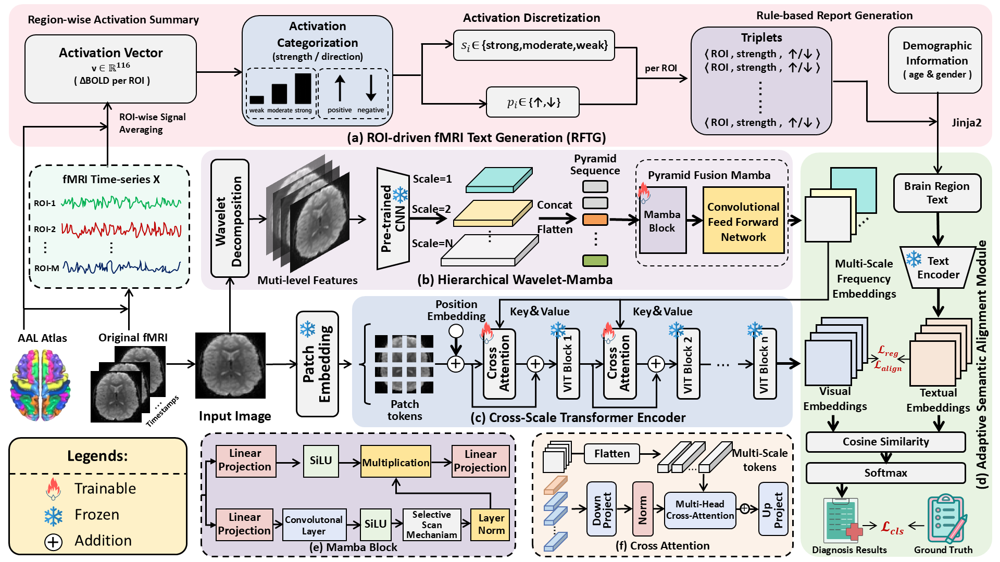
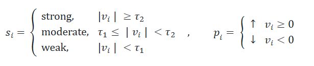

# 🧠 RTGMFF: Enhanced fMRI-based Brain Disorder Diagnosis via ROI-driven Text Generation and Multimodal Feature Fusion

This code is a pytorch implementation of our paper "RTGMFF: Enhanced fMRI-based Brain Disorder Diagnosis via ROI-driven Text Generation and Multimodal Feature Fusion".

<div align="center">



**Figure 1:** Overview of the RTGMFF pipeline.  
</div>

## 🧑🏻‍🏫 Background

Functional magnetic resonance imaging (fMRI) measures spontaneous brain activity and connectivity and has been widely used to study neurodevelopmental disorders such as **Attention‑Deficit/Hyperactivity Disorder (ADHD)** and **Autism Spectrum Disorder (ASD)**.  Large open datasets like ADHD‑200 and ABIDE make it possible to train machine learning models to detect these conditions.  For example, the ADHD‑200 consortium publicly released **776** resting‑state fMRI datasets collected from eight imaging sites, including **491** typically developing individuals and **285** children/adolescents diagnosed with ADHD. The ABIDE I release comprises fMRI data from **539** individuals with ASD and **573** control subjects (ages 7–64 years), while ABIDE II adds **521** ASD and **593** controls. However, fMRI signals are high‑dimensional and noisy, and cross‑subject heterogeneity and small sample sizes make classification challenging.

## 😖 Current Challenges

1. FMRI data typically lack accompanying textual descriptions, which are vital for interpreting brain-region connectivity and activity. 
2. Existing feature-extraction models underuse frequency-domain cues and rarely integrate frequency-spatial information within a unified representation.

## 🌟 Primary Contributions

To address these limitations, we propose RTGMFF, an enhanced fMRI-based brain disorder diagnosis pipeline that leverages ROI-driven fMRI text generation and multimodal feature fusion. Our contributions are summarized as follows: 

1. A deterministic ROI-driven fMRI text generator that fuses subject-specific activation statistics with demographic information to yield compact, reproducible tokens.
2. A hybrid frequency-spatial encoder that couples a hierarchical wavelet–mamba branch with a cross-scale Transformer encoder, jointly modeling frequency-domain structure and long-range spatial dependencies.
3. An adaptive semantic alignment module that embeds the ROI token sequence and aligns it with visual features through learnable projections and a cosine-based alignment loss with regularization to mitigate modality mismatch.

## ⚙️ Prerequisites

- Linux/Windows
- Python ≥ 3.8
- PyTorch ≥ 1.13
- NVIDIA GPU + CUDA cuDNN
- For fMRI loading: [nibabel](https://nipy.org/nibabel/), [numpy](https://numpy.org/), [pandas](https://pandas.pydata.org/)

## 📦 Datasets

### ADHD-200  
* **Subjects:** 491 typically developing (TD) + 285 ADHD (ages 7–21)  
* **Download:** <https://fcon_1000.projects.nitrc.org/indi/adhd200/>  
  * **Pre-processed edition (NeuroBureau):** <https://preprocessed-connectomes-project.org/adhd200/download.html>

### ABIDE I & II  

| Release | ASD | Controls | Age Range | Download Link |
|---------|-----|----------|-----------|---------------|
| **ABIDE I** | 539 | 573 | 7–64 y | <https://fcon_1000.projects.nitrc.org/indi/abide/abide_I.html> |
| **ABIDE II** | 521 | 593 | 5–64 y | <https://fcon_1000.projects.nitrc.org/indi/abide/abide_II.html> |

> **Note:** A free [NITRC](https://www.nitrc.org/) account is required to access raw NIfTI images and phenotypic spreadsheets.


## 🌵 Dependencies

Install the required packages via pip:

```bash
pip install torch torchvision numpy pandas nibabel scikit-learn tqdm
```

The table below lists core dependencies and tested versions:

<div align="center">

| Library      | Version | Library       | Version |
|-------------|---------|--------------|---------|
| PyTorch     | ≥1.13   | numpy        | ≥1.23   |
| torchvision | ≥0.14   | nibabel      | ≥3.0    |
| pandas      | ≥1.5    | scikit‑learn | ≥1.2    |
| transformers| ≥4.30   | tqdm         | ≥4.66   |

</div>

## 🍳 Training

Use `main.py` to train the RTGMFF model.  First, set the paths to your dataset and atlas, then specify hyperparameters.  For example, to train on ADHD‑200 with a base model:

```bash
python project/main.py \
  --dataset-name ADHD200 \
  --dataset-path /path/to/ADHD200 \
  --atlas-path /path/to/atlas/AAL116.nii.gz \
  --model-size base \
  --epochs 50 \
  --batch-size 16 \
  --learning-rate 1e-4
```

All training hyperparameters can be recorded by specifying `--save-path` for model weights and the script will automatically write the run configuration to a timestamped text file in `project/used_arguments`.

## 📝 Highlight: ROI-driven fMRI Text Generation (RFTG)

RFTG produces **deterministic, interpretable** text tokens from fMRI volumes without any trainable parameters.  
By eliminating randomness and heavy generative models, it delivers reproducible descriptions that radiologists can audit line-by-line.

### 1&nbsp; ROI Statistical Features
* Each 4-D fMRI scan is parcellated into **116** regions of interest (AAL-116 atlas).  
* After temporal denoising, the mean BOLD response per ROI forms a 116-dimensional vector:

<div align="center">
v = [Δ BOLD₁, …, Δ BOLD₁₁₆]
</div>


### 2&nbsp; Task-specific Ternary Discretisation
For every ROI \(i\) we jointly learn two thresholds on the training set (via nested cross-validation) that maximise diagnostic accuracy:

<div align="center">


 
</div>


### 3&nbsp; Demographic Conditional Modulation
Age and sex are encoded as:  

<div align="center">


 
</div>

and injected via **FiLM** layers to modulate intermediate visual and textual representations, embedding population priors directly into the feature space.

### 4&nbsp; Template-based Clinical Report
<div align="center">


**Figure&nbsp;3.** Jinja2-style template (left) and RFTG-generated report (right).
</div>

* One sentence per ROI ⇒ **fine-grained interpretability**  
* Zero parameters, instantly switchable on/off  
* Outputs are PACS/RIS-friendly and ready for copy-paste

<div align="center">


**Figure&nbsp;4.** Cortical activation heat-map (top) with matching auto-generated
sentences (bottom). Colour depth matches discretisation level.
</div>
